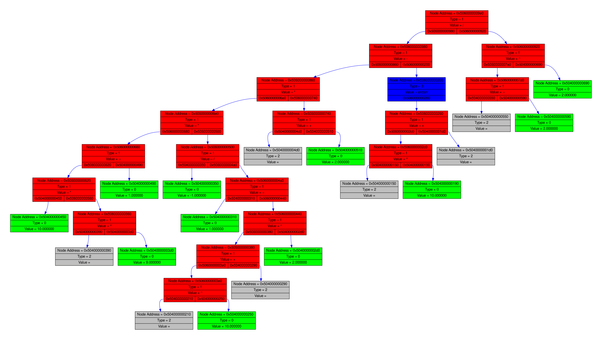

# Mathematical expression differentiation program
**About**

This program can calculate any derivative algebraically or numerically. It is also able to approximate functions with Taylor row. Results are saved in LaTex format.

**Functionality**

- Can calculate derivative of any algebraic expression with 1 variable (made so user can use literas instead of constants).
- Makes a .tex and .pdf file with results (there is step-by-step calcultation, result and Taylor's row coefficients with a plot). There is also tree dump version
- It supports command line instructions.

- Simplifies expressions.

- Has a tree dump function for debug purposes.

**Implementation details**
Program has lexer module to tokenize user's input and head tokens array to syntaxer. Expression is divide into Variables, Operations, Constants and Functions. Syntaxer is implemented by using recursive descent with following grammatics (Bacus Naur form):

\<Expression>::=\<Sum>+

\<Sum>::=\<Multiplication>+

\<Multiplication>::=\<Power>+

\<Power>::=\<Bracket>+

\<Bracket>::="("\<Expression>+")"|\<Function>+

\<Function>::=\<Variable>+

\<Variable>::= \<Number>+

\<Number>::= \<1, 2, 3, 0.67, 0.02>+

Syntaxer build expression tree which than is simplified. Currently program can make constant convolutions and remove nodes such as adding / substracting zero, multiplying by zero, log(1), $e^{0}$.

Example of a tree dump:

Program is using my N-ary tree which contains pointers to functions that work with it within its root. It also operates with void* type so it's a general tree which can be used for various purposes.

Program uses matplotlib library to create plots for .tex file.

**Usage**

To build differentiator on your PC you can use git clone and then use built-in Makefile, just make sure you have pip and pyplot installed.

Differentiator has a default mode in which it doesn't calculate Taylor approximation (but still makes a TeX file).

Differentiator's settings can be adjusted trhough command line.

List of commands:

--help 

--pdf [Output file name]

--point [double value] - point in which Taylor will be calculated (program can identify and prohibit actions such as dividing by zero)

--Taylor [integer value] - degree of Taylor's row approximation

Program also has error parser which will inform you if an error appears. You will be granted with a message containing information about the error.

